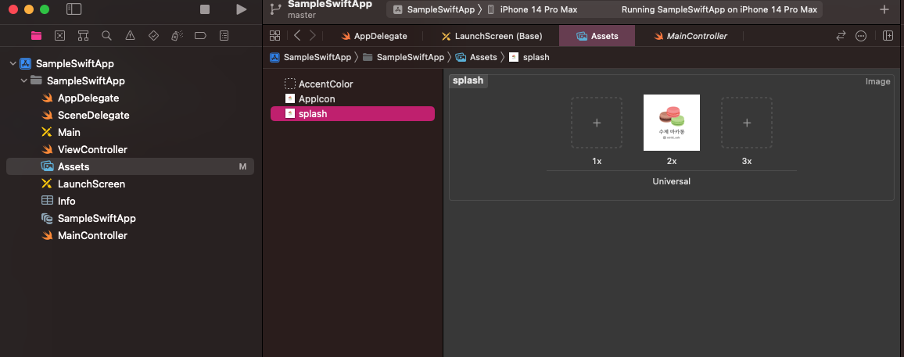
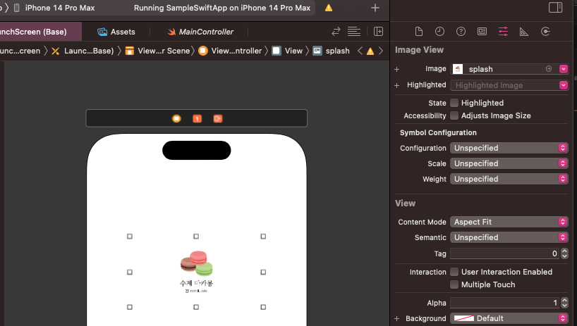
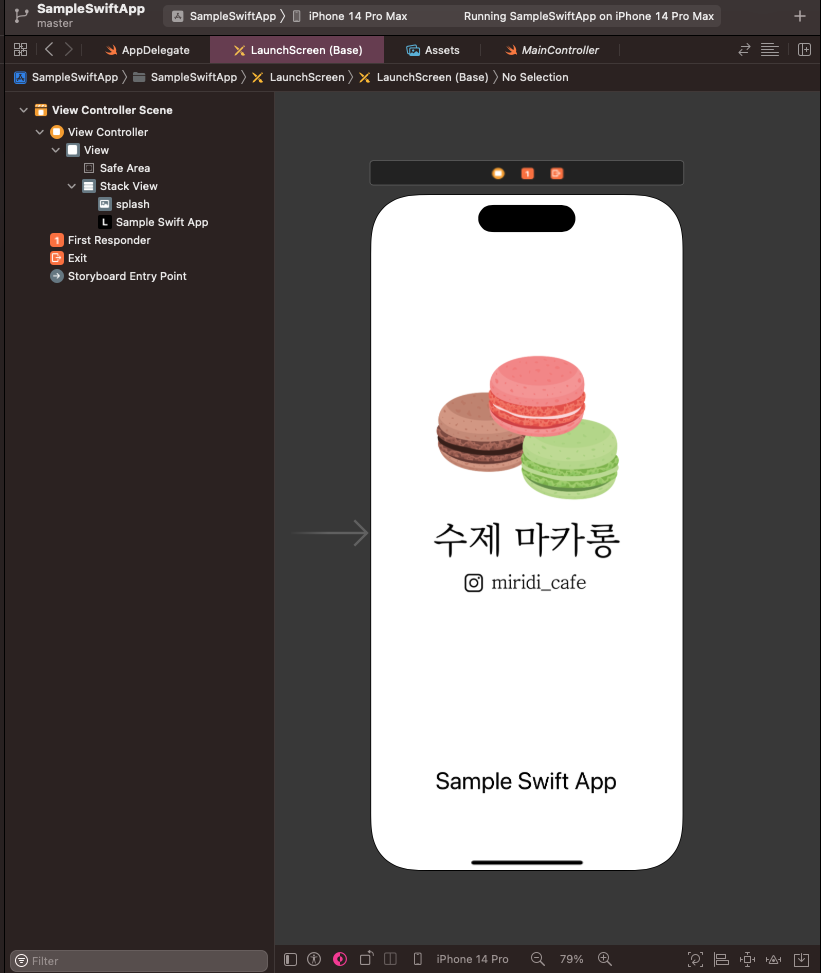

# sample-swift-app

Sample Swift 기반 모바일웹앱

## 강의 내용

### 2. 프로젝트 설정

- Display Name : 홈 화면에 표시되는 앱 이름 (프로젝트 이름과 동일). 여기에는 한글이름 입력해도 됨.
- Mininum deployments : 항상 최신 버전으로 설정되어있으므로 버전을 2정도 낮추기.
  - iOS13 이하로 하면 iOS13 부터 바뀐 것들 때문에 빌드가 안되므로 수정이 필요함
  - 강의에서는 iOS10으로 했으나 나는 그냥 iOS13으로 했음
- 그 외 설정은 안건들었음

### 3. 앱 아이콘

- 앱 개발에 필요한 리소스는 Assets에 추가하면 됨
- 앱 아이콘의 경우 AppIcon에 넣어놨음
- xcode14부터는 1024x1024 하나로 통일됐음

### 4. Launch Screen

- 앱 실행 시 잠깐 동안 보이는 화면
- splash로 쓸 화면을 Assets 폴더에 드래그 하기
- 이후 2x로 드래그 하기

- launch screen storyboard로 가서 spalsh 화면 구성
- library를 통해 추가하는 방식으로 진행함 (shift+cmd+L)

- image view에서 image 탭을 통해 이미지 추가

- label은 적당한 텍스트로 수정
- 다 했으면 storyboard 하단의 버튼 중 가장 마지막인 'Embeded In' 을 눌러서 Stack View로 변경

- stack view를 클릭 해서 각종 옵션 수정 가닝
  - Alignment : 정렬
  - Spacing : 위젯간 간격
- image view 클릭 후 제약조건 추가 가능 (가운데정렬)
  - 하단 버튼의 세번째
  - width, height를 256으로 설정하고 체크 하면 가운데 정렬
- 위젯의 제약조건 추가 (가운데정렬)
  - 하단 버튼의 두번째
  - horizontal, vertical을 모두 체크하면 가운데 정렬

## 소스구조

## TODO LIST

[ ] 기본 환경설정

[ ] 바텀탭네비게이션 설정

[ ] 웹뷰 화면 설정
