# sample-swift-app

Sample Swift 기반 모바일웹앱
웹뷰와 기본적인 앱 기능을 포함시킬거임
MVVM 패턴으로 도전

## 강의 내용

### 2. 프로젝트 설정

- Display Name : 홈 화면에 표시되는 앱 이름 (프로젝트 이름과 동일). 여기에는 한글이름 입력해도 됨.
- Mininum deployments : 항상 최신 버전으로 설정되어있으므로 버전을 2정도 낮추기.
  - iOS13 이하로 하면 iOS13 부터 바뀐 것들 때문에 빌드가 안되므로 수정이 필요함
  - 강의에서는 iOS10으로 했으나 나는 그냥 iOS13으로 했음
- 그 외 설정은 안건들었음

### 3. 앱 아이콘

- 앱 개발에 필요한 리소스는 Assets에 추가하면 됨
- 앱 아이콘의 경우 AppIcon에 넣어놨음
- xcode14부터는 1024x1024 하나로 통일됐음

### 4. Launch Screen

- 앱 실행 시 잠깐 동안 보이는 화면
- splash로 쓸 화면을 Assets 폴더에 드래그 하기
- 이후 2x로 드래그 하기

- launch screen storyboard로 가서 spalsh 화면 구성
- library를 통해 추가하는 방식으로 진행함 (shift+cmd+L)

- image view에서 image 탭을 통해 이미지 추가

- label은 적당한 텍스트로 수정
- 다 했으면 storyboard 하단의 버튼 중 가장 마지막인 'Embeded In' 을 눌러서 Stack View로 변경

- stack view를 클릭 해서 각종 옵션 수정 가닝
  - Alignment : 정렬
  - Spacing : 위젯간 간격
- image view 클릭 후 제약조건 추가 가능 (가운데정렬)
  - 하단 버튼의 세번째
  - width, height를 256으로 설정하고 체크 하면 가운데 정렬
- 위젯의 제약조건 추가 (가운데정렬)
  - 하단 버튼의 두번째
  - horizontal, vertical을 모두 체크하면 가운데 정렬

### 5. Main Layout

- 메인 레이아웃 구성하기
- 기본으로 설정된 ViewController는 제거하고 Navigation Controller 추가하기 (스토리보드에서 shift+cmd+L를 통해 추가했음)
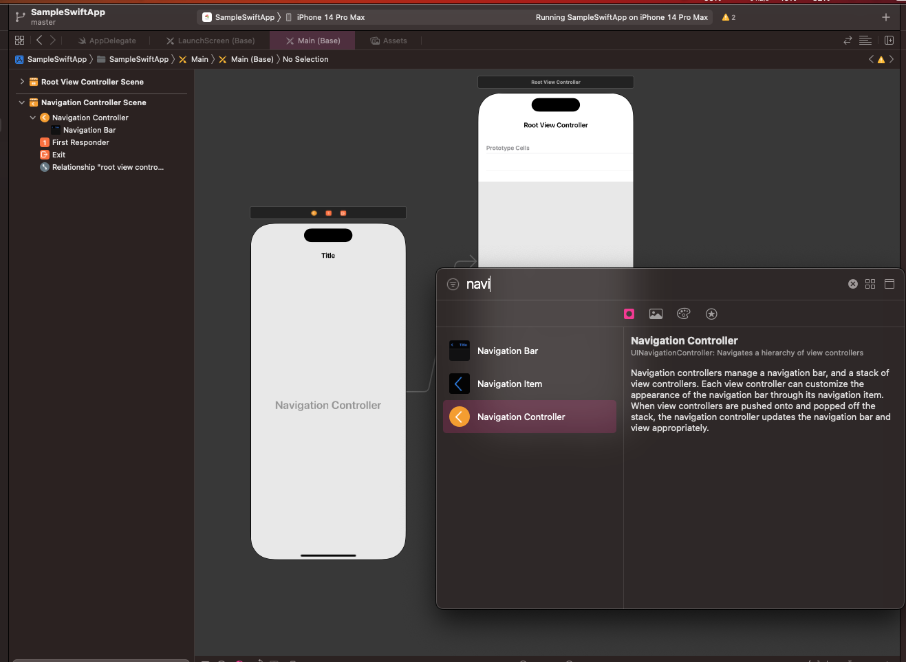

- 위 과정까지 하고 실행하면 검은화면이 나올텐데 앱 최초 화면을 설정안해서 그럴 확률이 매우 높음
- story board에서 is initail view controller에 꼭 체크하기

- 제목 변경, 버튼 추가, 라지 타이틀 모드 설정, 추가적으로 탭바 컨트롤러를 만들어서 두개로 만듬 (샘플 앱은 웹뷰까지 넣을것이므로...)
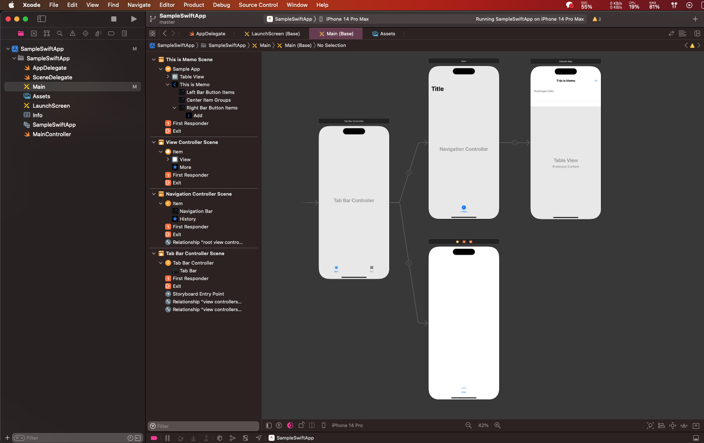

### 6. Memo Class

- 메모 처리에 사용할 클래스 생성

### 7. 메모 목록 구현

- 메모 목록을 보여줄거임
- prototype cell에서 디자인 수정 (서브타이틀 추가하는걸로)
- 각 위젯의 identifier를 설정할 수 있는데 무조건 겹치면 안됨

- 메모 목록을 구현하기 위해 cocoa touch class를 생성하고 UITableViewController를 상속받는 컨트롤러 생성
- 생성한 Controller와 뷰 화면을 연결하기
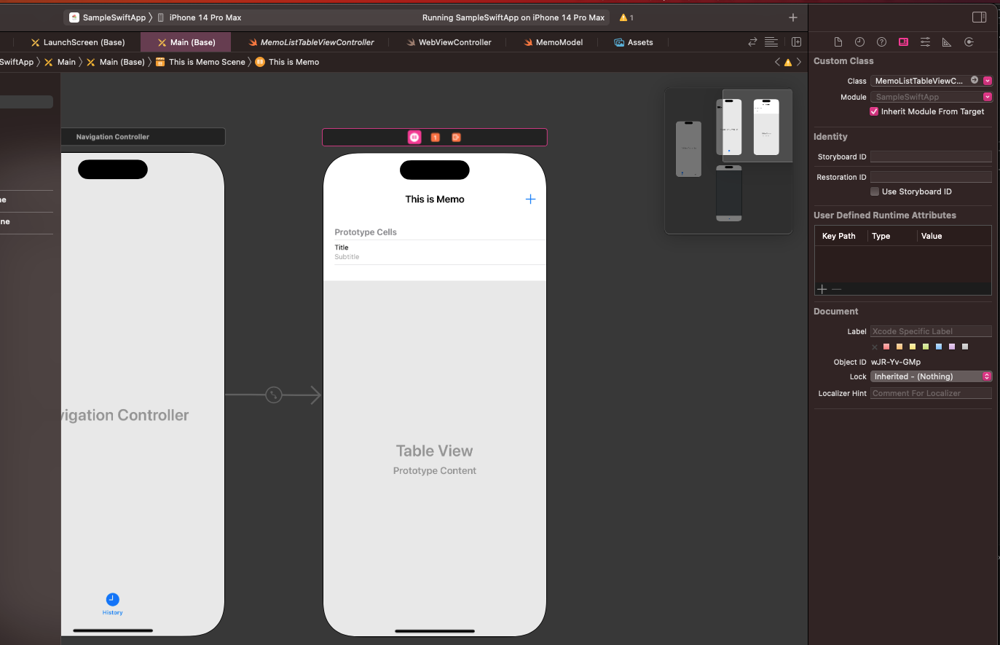

### 8. 테이블 뷰 구현 이론

- delegate 패턴에 대한 이해 필요

1. 테이블 뷰 배치
2. 프로토타입 셀 디자인, 셀 아이덴티파이어 지정
3. 데이터 소스, 델리게이트 연결
4. 데이터 소스 구현
5. 델리게이트 구현

### 9. 원하는 포멧으로 날짜 출력하기

- 날짜 포멧팅 설정 후 변경

### 10. 새 메모 쓰기 화면

- 새 메모 쓰기 화면 추가 (네비게이션컨트롤러 embed)
- "+" 버튼을 클릭 할 경우 페이지 이동하도록 처리
- modal 방식으로 처리하기 위해 present modal 로 설정
- Segue : 모바일 씬 사이의 연결을 정의해줌

- Segue 클릭 시 페이지 이동 방식을 설정할 수 있음
- 만약 풀스크린으로 가게 하면 닫기 버튼 또는 뒤로가기 버튼을 별도로 구현해야함
- 화면에 버튼 및 텍스트뷰 추가
- 텍스트 뷰의 경우 전체 화면을 차지하게 하려면 최대한으로 늘리고 나서 constraint를 추가해야함
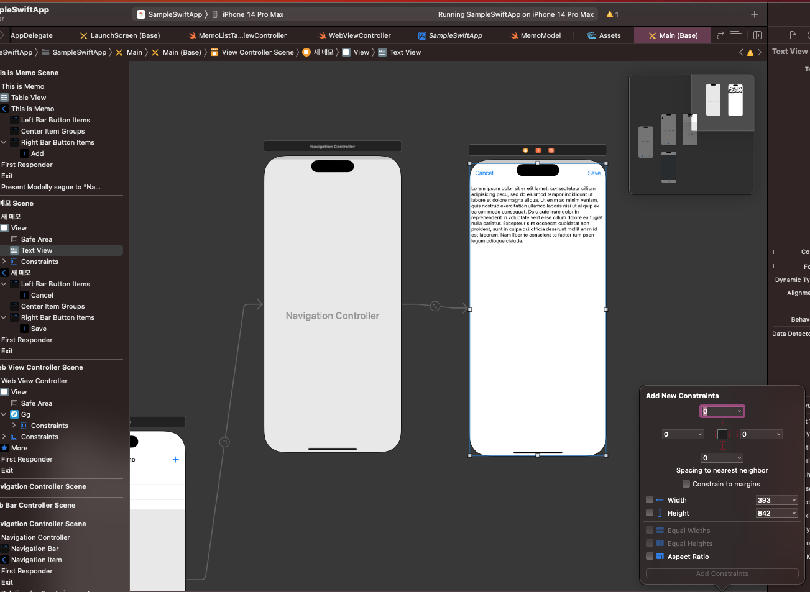

### 11. 취소 기능 구현

- button과 연결 (action으로 연결하기)
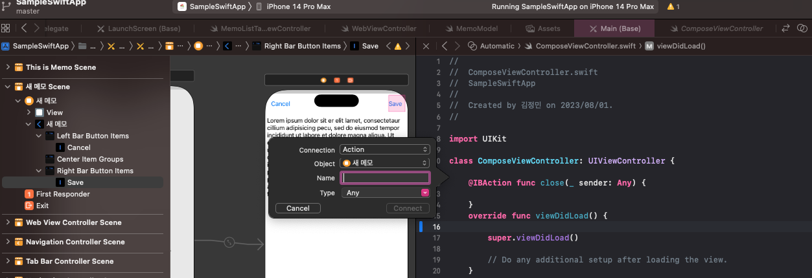

### 12. 메모 저장 기능 구현

- save 버튼과 이벤트 연결(action으로 연결, 취소와 동일함)
- 추가로 텍스트뷰도 연결(outletd으로)
- 메시지 안내를 위한 alert controller 생성
- uiviewcontroller를 상속받는 모든 컨트롤러에서 사용이 가능하도록 extension으로 만듬

### 13. 목록 업데이트

- 메모를 등록하면 목록이 업데이트 되도록 처리
- ios 버전마다 화면 전환 방식이 다르기 때문에 거기에 맞게 다 처리해야함
- Notification 으로 처리를 해야함
- Notification은 Ios에서 굉장히 중요한 개념이므로 꼭 숙지
- Notification은 사용하고 나서 꼭 해지를 해야함

### 14. 메모 보기화면 1

- 메모 상세 화면 구성(위젯 추가 및 제약조건 설정)
- Table view 에서 새로운 View 화면과 연결
- table view에 accessory 탭애서 화살표 추가 가능
- detail view 에 toolbar 추가
  - toolbar가 하단의 인디케이터에 맞게 설정되서 배경색이 다 잡혀야 맞게 간거임
  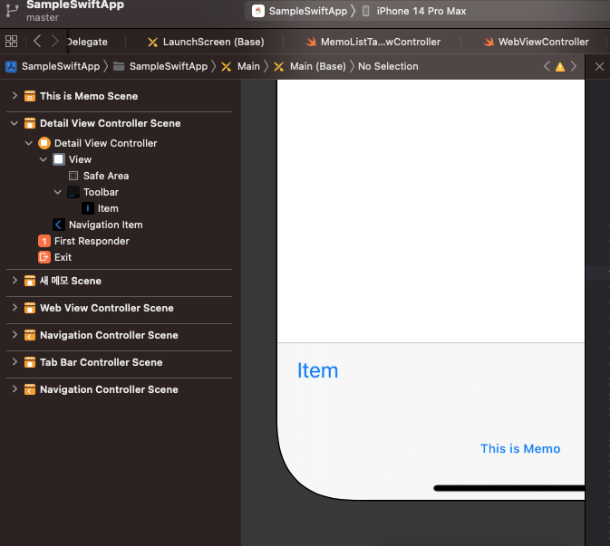
- table view를 익히기 위해서 상세보기 화면에 table view를 추가해줌(컨트롤러가 아닌 위젯으로)
  - table view는 디바이스 최상까지 올리기 (네비게이터랑 겹쳐도 알아서 여백이 생김)
- constraint 지정을 양쪽에 해줌
  - table view와 toolbar 모두 해야함 (table view는 4방향 전부, toolbar는 상단 제외하고 나머지 3곳)
  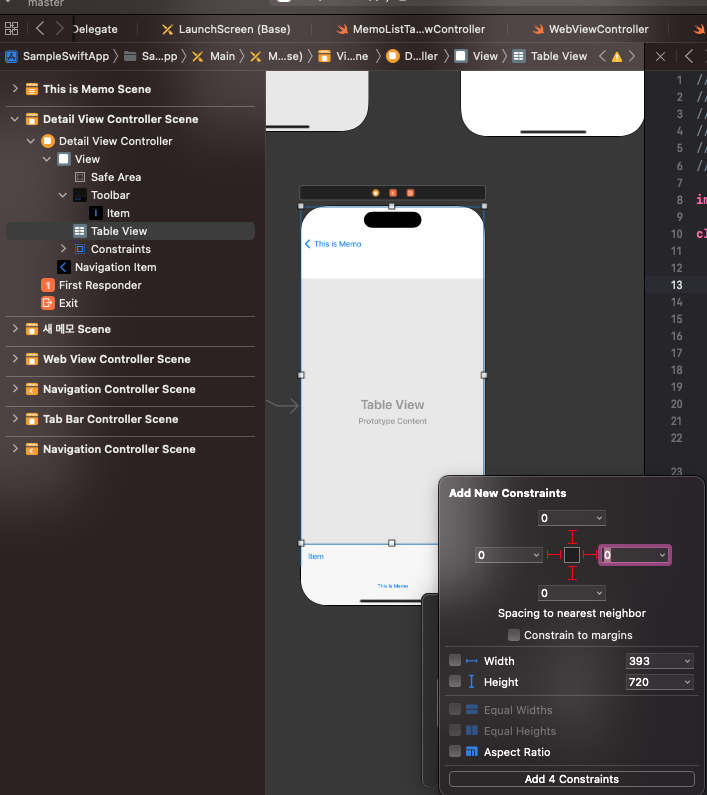
  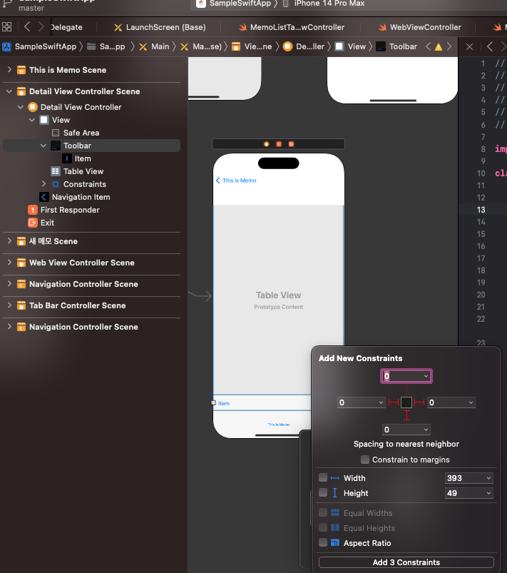

### 15. 메모 보기화면 2

- 테이블 뷰에 사용할 셀 추가
- 추가한 테이블뷰에 datasource 추가하기(테이블뷰를 뷰화면의 헤더로 연결하거나 아니면 마우스 오른쪽버튼 도 가능)
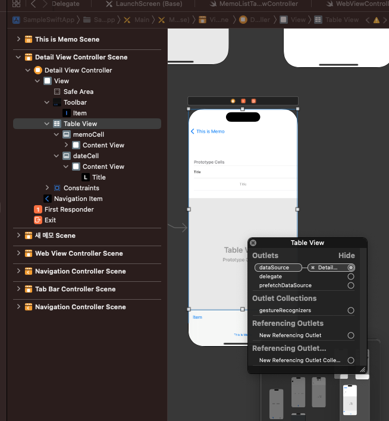
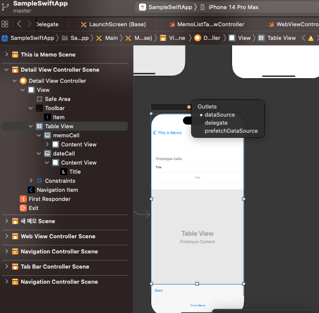

- datasource 연결 후 해당 컨트롤러에 UITableViewDataSource를 상속받는 extension 추가하기

### 16. 데이터 전달

- 페이지 이동 시 데이터 전달해서 보여주기
- segue를 통해서 데이터 전달하기
- ios14 이후부터 deprecated 되는 메서드들을 처리해줌

### 17. 선택 기능과 줄바꿈 구현

- 이전에 만든 보기화면 보강하기
- tableview의 선택기능 비활성화 하기
  - Separator : 테이블뷰의 구분선
  - Selection : 테이블뷰를 선택할 수 있는지 여부 선택

- label의 라인수에 상관없이 모든 텍스트를 보여지게 할 수도 있음
  - Lines : 보여질 라인 설정. 0이면 전체 보냄.
  - Line Break : 잘릴 텍스트를 어떻게 처리할지

### 18. DB 구현 1

- 메모 저장 기능 구현
- 데이터를 저장할떄는 Core Data를 사용함
- Core Data 저장을 위해 모델 생성
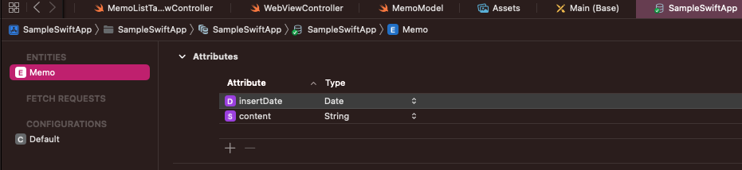

- Cord Data의 모델은 class로 하게 될 경우 다른 class와 이름이 겹치면 안됨
- 싱글톤 패턴을 사용해서 수정

### 19. DB 구현 2

- 데이터베이스에 저장하고 불러오기 기능 구현

## (번외) 웹뷰 셋팅

### 1. Webkit.framework 추가

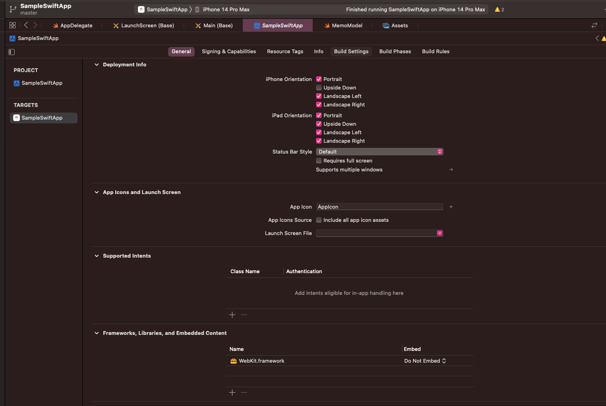

### 2. WebView 연결

- 스토리보드와 컨트롤러를 같이 열고, webview를 컨트롤러로 드래그 하면 연결됨

### 3. WebView 기본 설정 추가

- 뒤로가기 제스쳐 설정
- 캐시 없음 (캐시 처리도 필요할듯?)

## 소스구조

- webview : webview 관련 기본 설정들
- memo : kxcoding memo 강의에서 사용한 소스들

## TODO LIST

[X] 기본 환경설정

[X] 바텀탭네비게이션 설정

[X] 웹뷰 화면 설정

[ ] 기본 CRUD 처리

[ ] 웹뷰와 자바스크립트로 통신

## Code Challenge

[ ] full screen으로 이동했을 떄 뒤로가기 버튼 기능 구현
