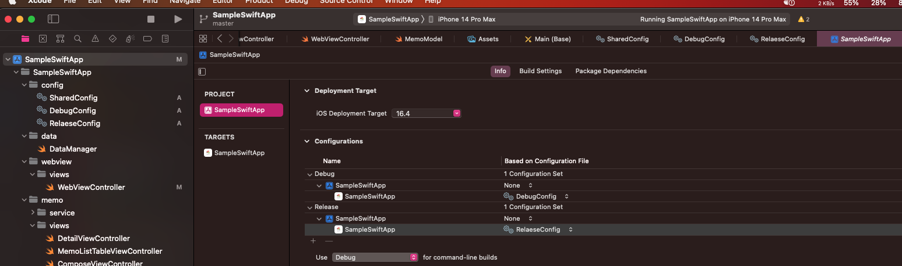
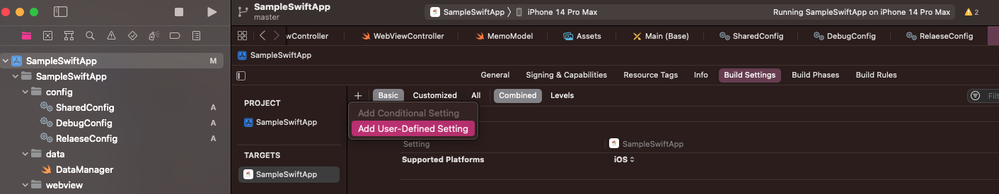
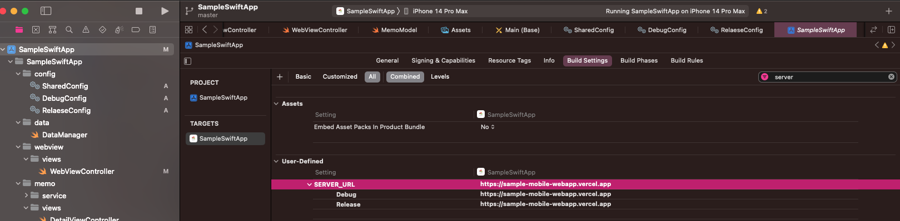
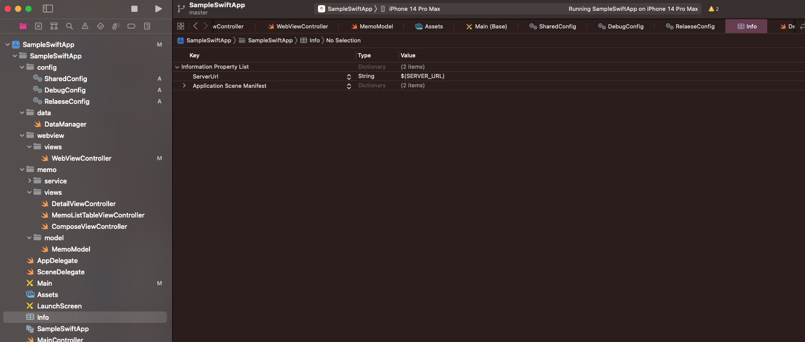

# Build 환경별 설정 방법


최종적으로 위와 같이 설정이 되야함

## 1. xcconfig로 하기

- 아래 블로그 참조하기


## 2. info.plist로 하기

- Proejct -> Build Settings에서 User-Defined setting 추가


- 원하는 값 등록


- info plist에 등록


- 저장한 값 조회

```swift
// 위의 사진 기준으로
let serverUrl = Bundle.main.object(forInfoDictoionaryKey: "SERVER_URL") as! String
```
